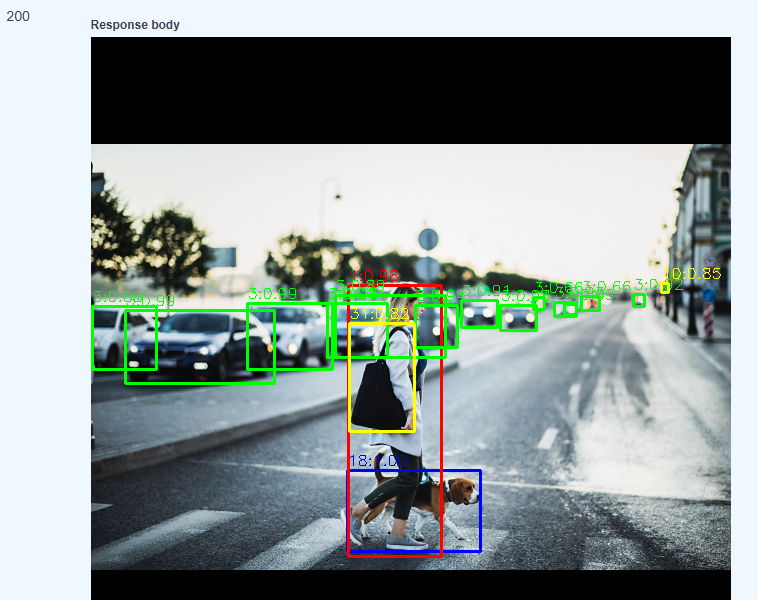
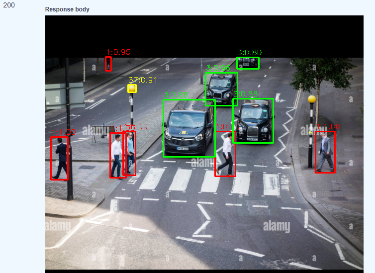
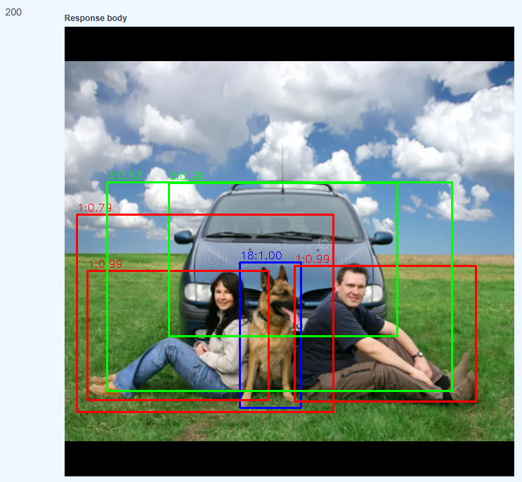
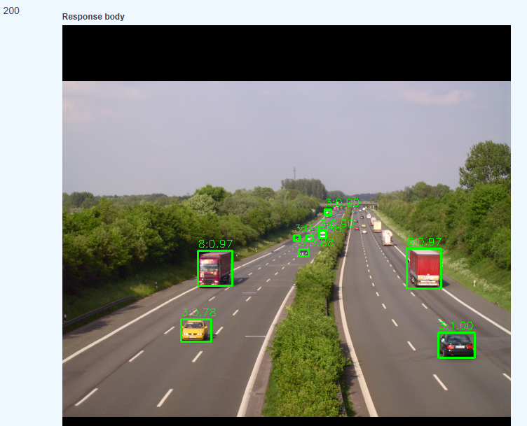
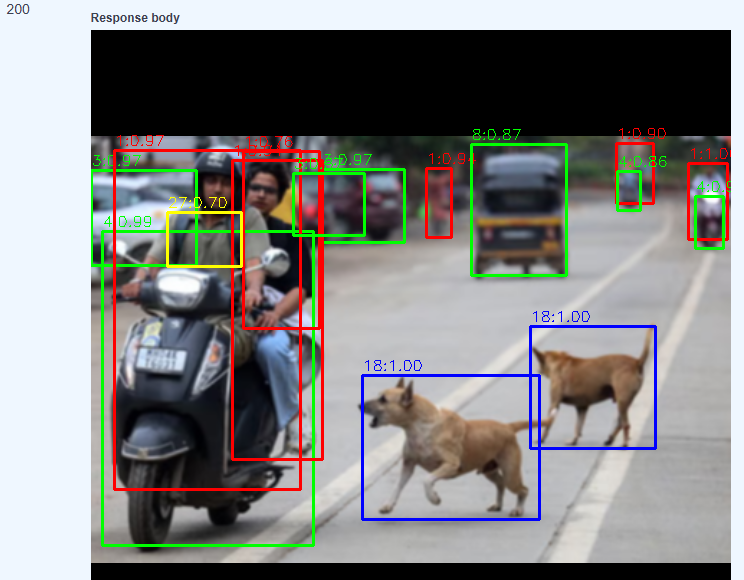
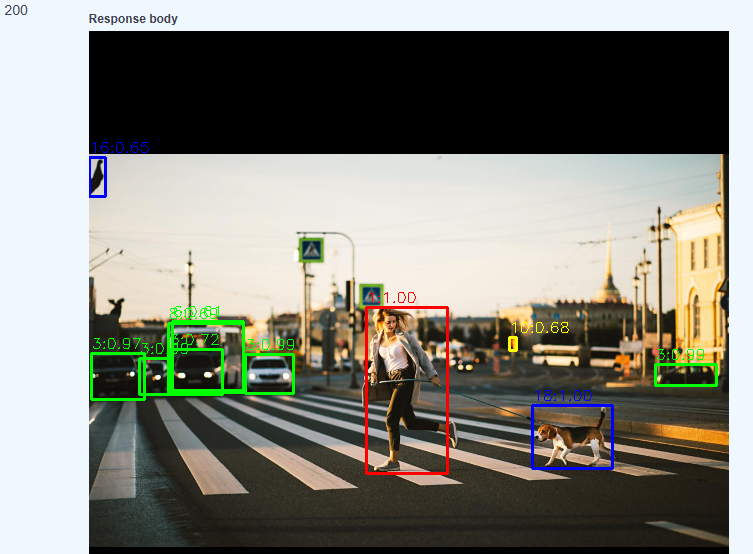
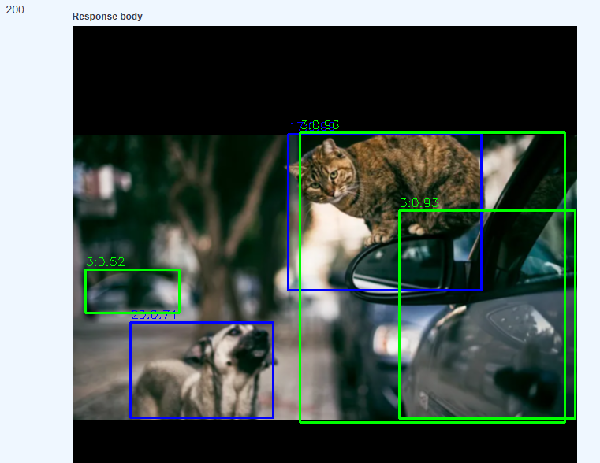
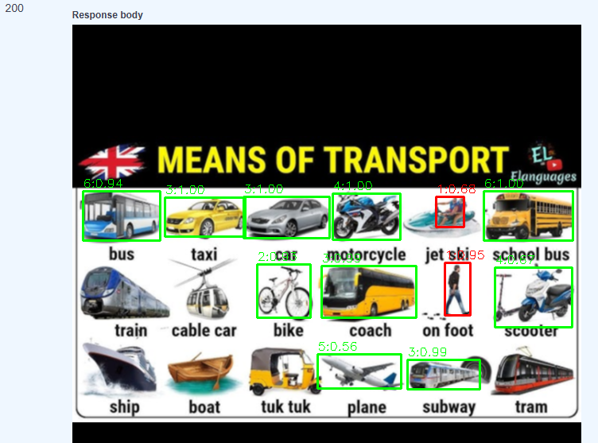

# Smart Visual Inspection System

[](#tech-stack)
[](#tech-stack)
[](#tech-stack)
[](#tech-stack)
[](#tech-stack)
[](#tech-stack)
[](#quick-start)
[](#requirements)

A production-ready backend-oriented platform for **visual inspection** with asynchronous CV inference, job tracking, and result delivery via REST API.

---

## Table of Contents

- [Overview](#overview)
- [Key Features](#key-features)
- [System Architecture](#system-architecture)
- [Tech Stack](#tech-stack)
- [Project Structure](#project-structure)
- [Quick Start](#quick-start)
- [Requirements](#requirements)
- [Configuration](#configuration)
- [Visualization Legend](#visualization-legend)
- [API Reference](#api-reference)
- [CV Pipeline Flow](#cv-pipeline-flow)
- [Demo Results](#demo-results)
- [Development Workflow](#development-workflow)
- [Testing & Quality](#testing--quality)
- [Deployment Notes](#deployment-notes)
- [Roadmap](#roadmap)

---

## Overview

**Smart Visual Inspection System** processes input images (or frames) through a computer vision pipeline and exposes:

1. **Secure API access** (registration/token-based auth).
2. **Asynchronous analysis jobs** (Celery + Redis queue).
3. **Job lifecycle tracking** (status/result retrieval).
4. **Inference result artifacts** (processed image endpoint).

The project is designed for scalable inspection scenarios such as:

- transport monitoring,
- people/animal detection,
- edge-camera assisted analytics,
- and defect/event detection workflows.

---

## Key Features

- **CV-first architecture** built around preprocessing → inference → postprocessing stages.
- **Async execution** for non-blocking API responses under heavy workloads.
- **Token-based authentication** for protected endpoints.
- **Model introspection endpoint** to expose available inference options.
- **Containerized runtime** with Docker Compose for reproducible setup.
- **Clear modular structure** for API, CV logic, DB layer, and background tasks.

---

## System Architecture

```text
Client
  └──> FastAPI REST API
          ├──> Auth & validation
          ├──> Job creation / querying
          └──> Redis broker
                  └──> Celery worker
                          └──> CV Pipeline
                                  ├── Preprocessing
                                  ├── Inference
                                  └── Postprocessing
                                        └── Persist / expose results
```

---

## Tech Stack

### Computer Vision
- **OpenCV** — image preprocessing and frame-level transformations.
- **PyTorch / TorchVision** — deep-learning based detection pipeline.

### Backend & Async Processing
- **FastAPI** — high-performance REST API.
- **Celery** — background task orchestration.
- **Redis** — broker/result backend and fast state exchange.

### Infrastructure
- **Docker + Docker Compose** — local orchestration and consistent environments.
- **Python 3.11+** — main runtime.

---

## Project Structure

```text
app/
  api/              # REST endpoints, dependencies, API versioning
  core/             # configuration, security, storage utilities
  cv/               # preprocessing, inference, postprocessing, pipeline
  db/               # session and ORM models
  schemas/          # Pydantic request/response contracts
  tasks/            # Celery background jobs
  main.py           # FastAPI app entrypoint

tests/
  test_api/         # API and auth tests
  test_cv/          # computer vision unit tests
```

---

## Quick Start

```bash
docker compose up --build
```

After startup:
- API: `http://localhost:8000`
- Swagger UI: `http://localhost:8000/docs`
- Health check: `http://localhost:8000/health`

---

## Requirements

- Docker 24+
- Docker Compose v2+

For local non-container runs (optional):
- Python 3.11+
- Redis

---

## Configuration

Main runtime configuration is centralized in `app/core/config.py`.
Typical settings include:

- application mode/environment,
- security/auth parameters,
- queue/broker connection settings,
- storage/result-related paths.

> Tip: keep environment-specific values in `.env` files and never commit secrets.

---

## Visualization Legend

Annotated output images use category-based bounding box colors:

- 🟩 **Green** — transport objects (e.g., car, motorcycle, bus, train, truck, boat)
- 🟥 **Red** — people
- 🟦 **Blue** — animals
- 🟨 **Yellow** — fallback for other detected classes

This makes mixed scenes easier to read and quickly separates the three primary inspection groups.

---

## API Reference

### Authentication
- `POST /api/v1/auth/register` — create a user account.
- `POST /api/v1/auth/token` — obtain access token.

### Analysis & Jobs
- `POST /api/v1/analyze` — submit an analysis job.
- `GET /api/v1/jobs/{job_id}` — get job status/details.
- `GET /api/v1/jobs/{job_id}/image` — download/view processed image.
- `GET /api/v1/jobs` — list jobs.
- `DELETE /api/v1/jobs/{job_id}` — remove a job.

### Models & Health
- `GET /api/v1/models` — list available CV models.
- `GET /health` — service health endpoint.

Interactive docs are available at `/docs`.

---

## CV Pipeline Flow

1. **Input acquisition** from API payload.
2. **Preprocessing** with OpenCV transformations.
3. **Inference** through configured PyTorch/TorchVision model.
4. **Postprocessing** (filtering, formatting, optional overlays).
5. **Result publication** through job endpoint and output artifact endpoint.

---

## Demo Results

Below are sample annotated outputs with bounding boxes:










---

## Development Workflow

Run app stack:
```bash
docker compose up --build
```

Stop stack:
```bash
docker compose down
```

---

## Testing & Quality

Run locally:

```bash
docker compose exec api python -m pytest --cov=app
docker compose exec api ruff check .
docker compose exec api black --check .
```

---
