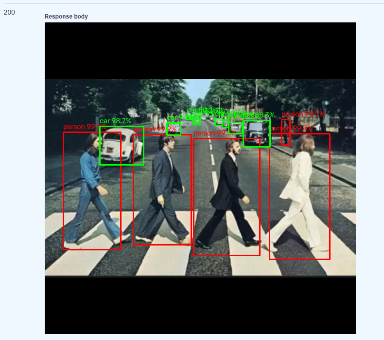
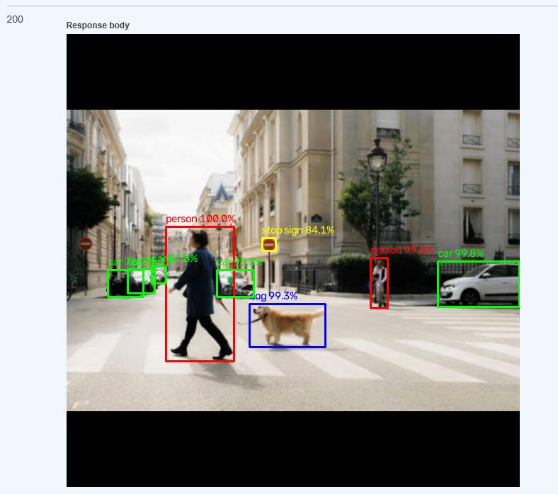
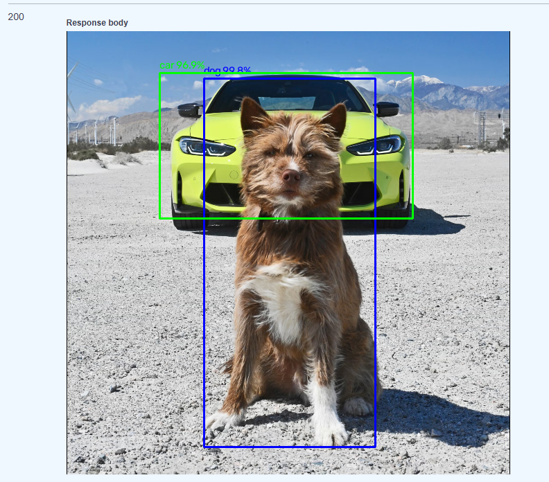
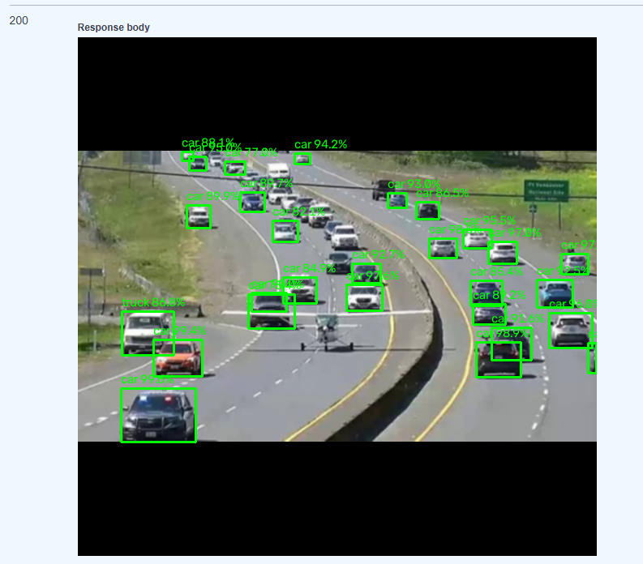
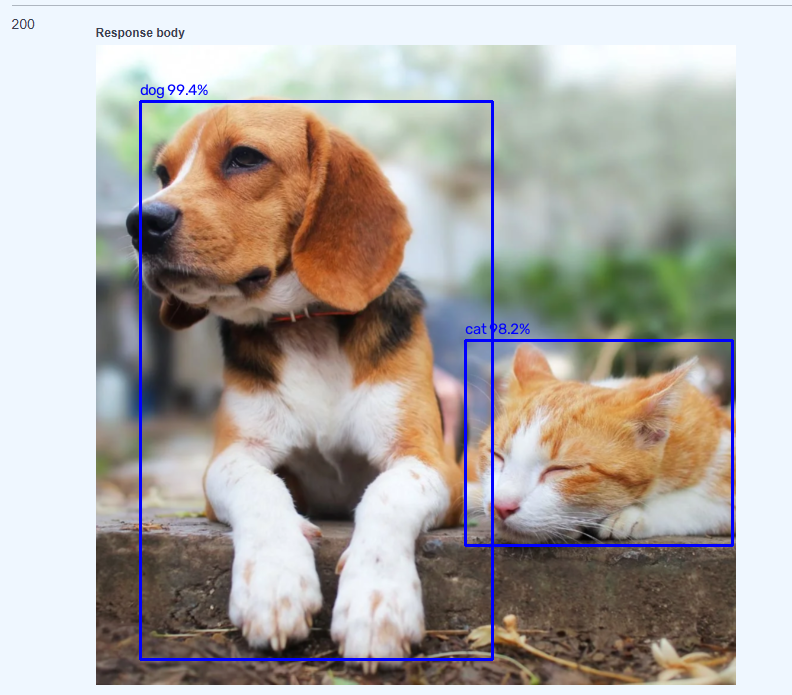
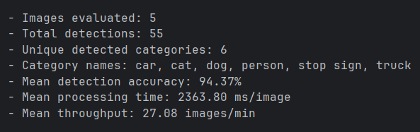

# Smart Visual Inspection System

[](#tech-stack)
[](#tech-stack)
[](#tech-stack)
[](#tech-stack)
[](#tech-stack)
[](#tech-stack)
[](#quick-start)
[](#requirements)

A production-ready backend-oriented platform for **visual inspection** with asynchronous CV inference, job tracking, and result delivery via REST API.

---

## Table of Contents

- [Overview](#overview)
- [Key Features](#key-features)
- [System Architecture](#system-architecture)
- [Tech Stack](#tech-stack)
- [Project Structure](#project-structure)
- [Quick Start](#quick-start)
- [Requirements](#requirements)
- [Configuration](#configuration)
- [Visualization Legend](#visualization-legend)
- [Evaluation Metrics](#evaluation-metrics)
- [API Reference](#api-reference)
- [CV Pipeline Flow](#cv-pipeline-flow)
- [Demo Results](#demo-results)
- [Development Workflow](#development-workflow)
- [Testing & Quality](#testing--quality)

---

## Overview

**Smart Visual Inspection System** processes static input images through a computer vision pipeline and exposes:

1. **Secure API access** (registration/token-based auth).
2. **Asynchronous analysis jobs** (Celery + Redis queue).
3. **Job lifecycle tracking** (status/result retrieval).
4. **Inference result artifacts** (processed image endpoint).

The project is designed for scalable inspection scenarios such as:

- people/animal/transport detection,
- static-scene visual analytics,
- and object/event detection workflows.

## Configuration

Main runtime configuration is centralized in `app/core/config.py`.
Typical settings include:

- application mode/environment,
- security/auth parameters,
- queue/broker connection settings,
- storage/result-related paths.
- `detection_confidence_threshold` — minimum model confidence for drawing
  boxes and returning detections. The default is `0.7` (70%), which reduces
  noisy low-confidence boxes around objects.

> Tip: keep environment-specific values in `.env` files and never commit secrets.

---

## Visualization Legend

Annotated output images use category-based bounding box colors:

- 🟩 **Green** — transport objects (e.g., car, motorcycle, bus, train, truck, boat)
- 🟥 **Red** — people
- 🟦 **Blue** — animals
- 🟨 **Yellow** — fallback for other detected classes

This makes mixed scenes easier to read and quickly separates the three primary inspection groups.
Bounding boxes are labeled with the detected object name and confidence percentage (for example, `person 98.7%`) instead of raw model class IDs.

---

## Demo Results

Below are sample annotated outputs with bounding boxes:







---

## Evaluation Metrics

Each completed job includes a JSON summary with metrics for quick assessment:

- `detection_accuracy_percent` — mean confidence of detections that passed the threshold, reported as a percentage.
- `detected_category_count` — number of unique object categories found in the image.
- `detected_categories` — sorted names of categories found in the image.
- `model_category_count` — number of COCO object categories supported by the configured model.
- `processing_time_ms` / `processing_time_sec` — end-to-end image processing time.
- `throughput_images_per_min` — estimated single-worker throughput derived from processing time.
- `total_detections` and `max_confidence` — detection volume and strongest model confidence.
- `detection_confidence_threshold_percent` — active confidence cutoff used for
  filtering and drawing bounding boxes.

> Note: this project reports **mean confidence of accepted detections** as a
> practical detection-accuracy proxy because the bundled test images do not
> include ground-truth annotation files. For formal mAP/precision/recall
> evaluation, add labeled bounding boxes for the same images.

### Benchmark bundled test images

Run the benchmark helper against the images in `tests/imgs/test`:

```bash
docker compose exec api python -m scripts.evaluate_test_images tests/imgs/test

if local
PYTHONPATH=. python scripts/evaluate_test_images.py tests/imgs/test
```

The helper prints per-image metrics and aggregate values:

| Metric | Meaning |
| --- | --- |
| Detections | Number of boxes that passed the configured confidence threshold. |
| Accuracy (%) | Mean confidence percentage for accepted detections. |
| Categories | Count and names of unique object classes detected in the image. |
| Processing (ms) | End-to-end preprocessing, inference, postprocessing, and annotation time. |
| Throughput (images/min) | Estimated single-worker throughput from processing time. |

Current benchmark configuration:

- Model: TorchVision Faster R-CNN ResNet-50 FPN with COCO weights.
- Confidence threshold: 70%.
- Categories supported by the model: 80 COCO object classes.
- Test image directory: `tests/imgs/test`.



---

## API Reference

### Authentication
- `POST /api/v1/auth/register` — create a user account.
- `POST /api/v1/auth/token` — obtain access token.

### Analysis & Jobs
- `POST /api/v1/analyze` — submit an analysis job.
- `GET /api/v1/jobs/{job_id}` — get job status/details.
- `GET /api/v1/jobs/{job_id}/image` — download/view processed image.
- `GET /api/v1/jobs` — list jobs.
- `DELETE /api/v1/jobs/{job_id}` — remove a job.

### Models & Health
- `GET /api/v1/models` — list available CV models.
- `GET /health` — service health endpoint.

Interactive docs are available at `/docs`.

---

## CV Pipeline Flow

1. **Input acquisition** from API payload.
2. **Preprocessing** with OpenCV transformations.
3. **Inference** through configured PyTorch/TorchVision model.
4. **Postprocessing** (filtering, formatting, optional overlays).
5. **Result publication** through job endpoint and output artifact endpoint.

---

## Development Workflow

Run app stack:
```bash
docker compose up --build
```

Stop stack:
```bash
docker compose down
```

---

## Testing & Quality

Run locally:

```bash
docker compose exec api python -m pytest --cov=app
docker compose exec api ruff check .
docker compose exec api black --check .
```

---
